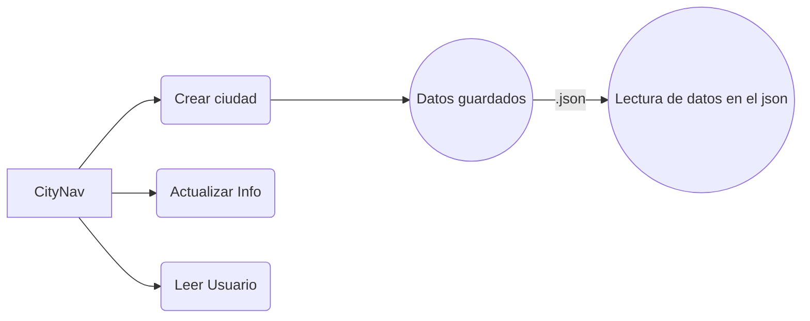

# CityNav 🌏🌐

## Tabla de contenido
| Indice | Título  |
|--|--|
| 1. | [Descripción](#Descripcion) |
| 2. | [Caracteristicas Principales](#Caracteristicas) |
| 3. | [Tecnologias Utilizadas](#Tecnologias) |
| 4. | [Instrucciones de Ejecución](#Instrucciones-de-ejecucion) |
| 5. | [Mapa](#Mapa) |
| 6. | [Autores](#Autores) |

#### Descripcion 🚀

El proyecto CityNav consiste en un buscador de ciudades por su nombre, codigo postal, numero de poblacion y pais al que pertenece

#### Caracteristicas 🧮

1. **Crear ciudad** 👥: Permite registrar y añadir informacion de la ciudad que se quiere crear

2. **Actualizar ciudad** 🌐: Permite actualizar informacion de la ciudad 

3. **Buscar ciudad** 🌐: Permite buscar ciudades

#### Tecnologias  🖥️

- **Python** 🐍: Todas la aplicacion esta hecha con python.

#### Instrucciones de ejecucion 📐

1. Clona el repositorio a tu máquina local. 
2. Configura adecuadamente todo lo adecuado drespecto a python.
3. Ejecuta el proyecto desde la terminal.

#### Mapa 

#### Autores 👤

Juan David Conde Martínez
Leonardo Gonzalez
